# CalmBar 🌬️

> **macOS 全能系统增强套件** —— 硬件温控 · 菜单栏收纳 · 鼠标滚轮解耦 · 媒体启动拦截 · 系统防休眠防离开 · 充电管理与电池上限 · 应用去隔离授权 · 屏幕文字与二维码识别 · 剪贴板历史管理 · 软件卸载与开发者环境深度清理

[](https://apple.com/macos)
[](https://apple.com)
[](https://swift.org)
[](https://github.com/chao-eng/CalmBar/releases)
[](LICENSE)

---

## 📖 简介

**CalmBar** 是一款使用 **Swift 6 + SwiftUI + AppKit** 打造的轻量级 macOS 菜单栏综合增强套件。旨在解决日常 macOS 体验中的核心痛点：

1. **散热策略滞后**：官方 SMC 策略常常在撞温度墙后才大幅提速，CalmBar 提供实时硬件温度监控与灵活的温控加速曲线。
2. **菜单栏杂乱遮挡**：在刘海屏或小屏幕上，过多第三方图标容易溢出或被遮挡，CalmBar 提供一键折叠与自动收纳。
3. **鼠标与触控板手势绑定**：macOS 原生设置无法对外接鼠标与触控板分开设置滚动方向，CalmBar 独立解耦外接鼠标滚轮与原生触控板手势。
4. **Apple Music 误触发唤醒**：连接 AirPods / 蓝牙耳机或误触播放键时系统频繁强行弹出 Apple Music，CalmBar 拦截并支持拉起替代音乐应用或网页。
5. **长任务休眠与闲置离开判定**：长任务、文件传输或挂机时屏幕自动熄屏休眠，CalmBar 提供原生 IOKit 防休眠断言，并通过 IOHIDSystem 闲置检测模拟轻量微动降低协同软件的离开判定。
6. **插电满电高压损耗电池**：长期插电使用电量持续处于 100% 易加速电池损耗老化，CalmBar 提供 80% SMC 充电上限保护与回差巡航（带 15% 底层安全熔断与看门狗）。
7. **未签名与已损坏应用拦截**：外部下载软件常因 Gatekeeper 隔离标记报错无法打开，CalmBar 支持拖拽一键递归去隔离与 Ad-hoc 自签名修复。
8. **屏幕信息快速提取与归档**：无需安装庞大第三方 OCR 软件，CalmBar 原生集成 Apple Vision 深度学习识别引擎，支持屏幕选区识字、二维码/条码解析与历史管理。
9. **剪贴板碎片化与数据丢失**：原生剪贴板仅保留单次复制，CalmBar 提供多模态格式捕获、图片智能升格、Vision OCR 文字/二维码索引与隐私过滤。
10. **应用卸载残留与开发缓存积压**：原生拖进废纸篓只带走主程序，散落在 Library 中的几个 GB 偏好与缓存依然霸占硬盘；Xcode/Node/Python 等工具链缓存及已被删除工程的历史工作区日积月累，CalmBar 提供一键应用深层卸载与开发者环境专属清理。

---

## 📸 界面预览 (UI Showcase)

<p align="center">
  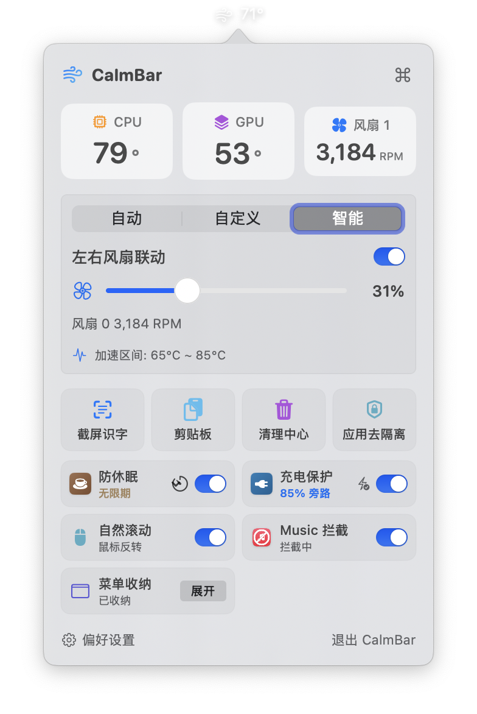
  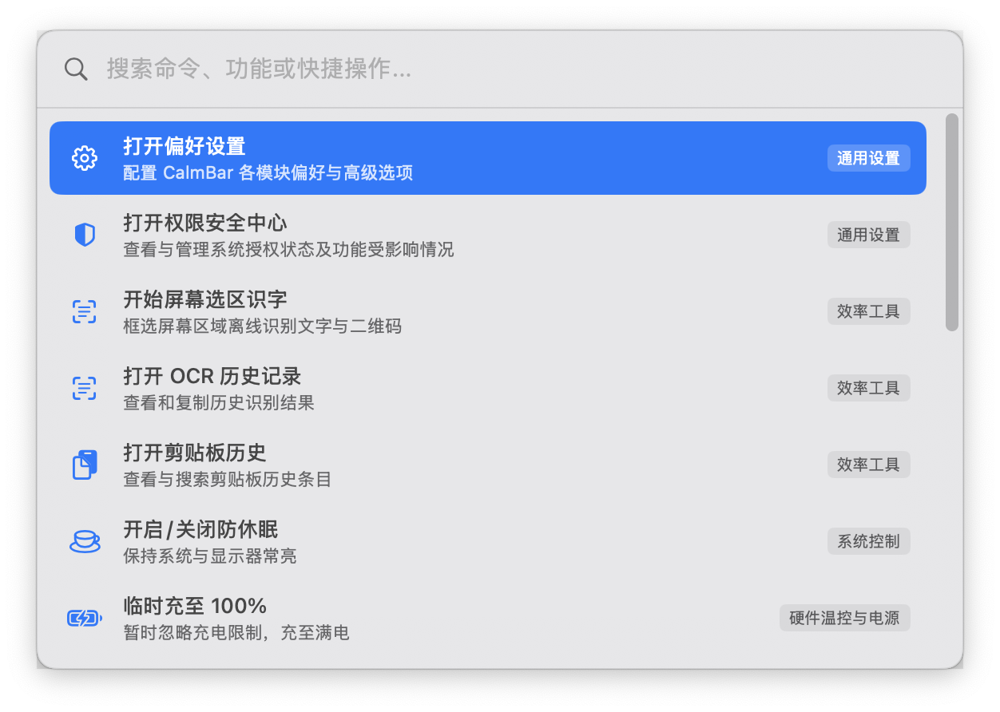
</p>

---

## ✨ 核心功能与操作说明

### 1. ⚡ Command Palette 全局命令面板
* **核心亮点**：Spotlight 风格全局浮动命令面板，随时快速调度所有系统功能与工具。
* **🕹️ 操作说明**：
  1. 按下全局快捷键 `⌥ + ⌘ + K`（或点击菜单栏面板右上角的 `⌘` 图标）即可唤起命令面板。
  2. 直接输入文字、英文关键词或拼音首字母（如输入 `sz` 找识字、`ql` 找清理、`cd` 找充电）。
  3. 使用键盘上下方向键选择命令，按 `Enter` 键即可一键执行。

<p align="center">
  
</p>

---

### 2. 🌡️ 硬件监控与智能风扇调控 (Thermal & Fan Control)
* **全芯片温度传感器覆盖**：原生适配 Apple Silicon（M1/M2/M3/M4 系列）及 Intel 芯片机型，实时读取 CPU 核心群簇、GPU 核心、电池与 SoC 模块温度。
* **三档调控模式**：
  * **自动 (Auto)**：重置为系统原生默认托管（SMC 官方策略）。
  * **自定义 (Manual)**：提供无级滑块，支持自由锁定指定转速百分比或 RPM。
  * **智能温控 (Smart Curve)**：基于起始加速温度与满速温度阈值，自动执行平滑插值加速曲线，高效静音散热。
* **多风扇控制策略**：双风扇机型支持“左右风扇联动调速”与“分别独立控制”。
* **故障安全机制 (Fail-Safe)**：软件退出、重启、系统休眠或异常崩溃时，自动将 SMC 控制权安全交还给 macOS 官方固件，避免硬件过热。
* **🕹️ 操作说明**：
  * 点击菜单栏图标展开主面板，顶部实时显示 CPU/GPU 温度与风扇转速，直接切换三档模式或滑动无级滑块。
  * 打开偏好设置的 **「硬件温控」** 页面，可精确调节智能加速曲线的起始温度与满速温度，并实时查看各个核心传感器的具体度数。

<p align="center">
  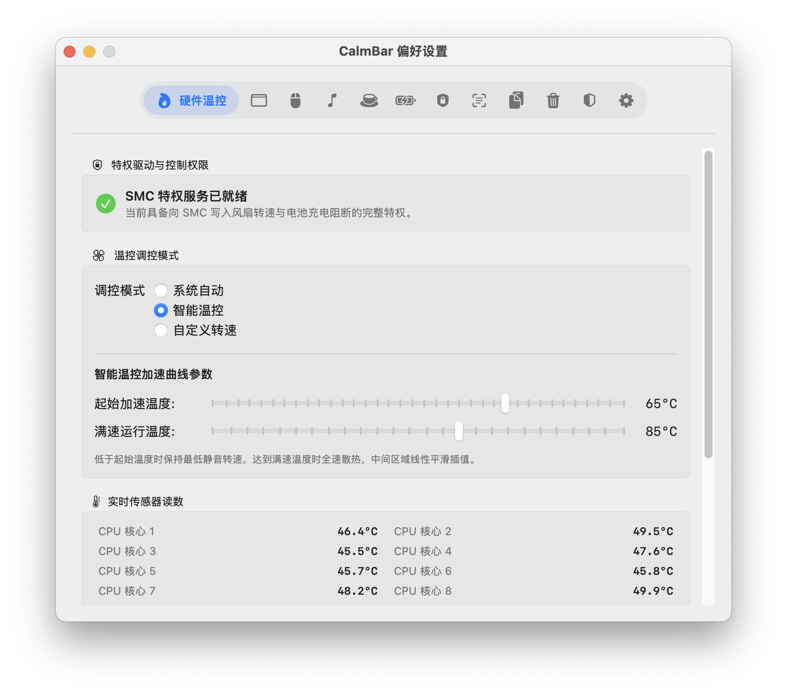
</p>

---

### 3. 🗂️ 菜单栏图标收纳 (Menu Bar Organizer)
* **优雅折叠与展开**：
  * 按住键盘 **Command (⌘)** 键，直接将需要隐藏的低频图标拖动到 **收纳分隔符 `/` 的左侧**。
  * 点击 **`<`** 箭头（或按下快捷键 `⌥ + ⌘ + H`），即可一键收起隐藏；再次点击即可展开。
* **开机静默收纳**：程序启动时默认保持折叠收纳状态，保持菜单栏清爽整洁。
* **自动化收纳**：支持配置“展开后无操作 N 秒自动折叠”与“鼠标悬停自动展开”。
* **🕹️ 操作说明**：
  * 在菜单栏主面板点击 **「菜单收纳」** 卡片右侧的「展开/折叠」微按钮即可切换。
  * 在偏好设置的 **「菜单收纳」** 选项卡中，可自由调整折叠延迟秒数（默认 5 秒）或启用鼠标悬停自动展开。

<p align="center">
  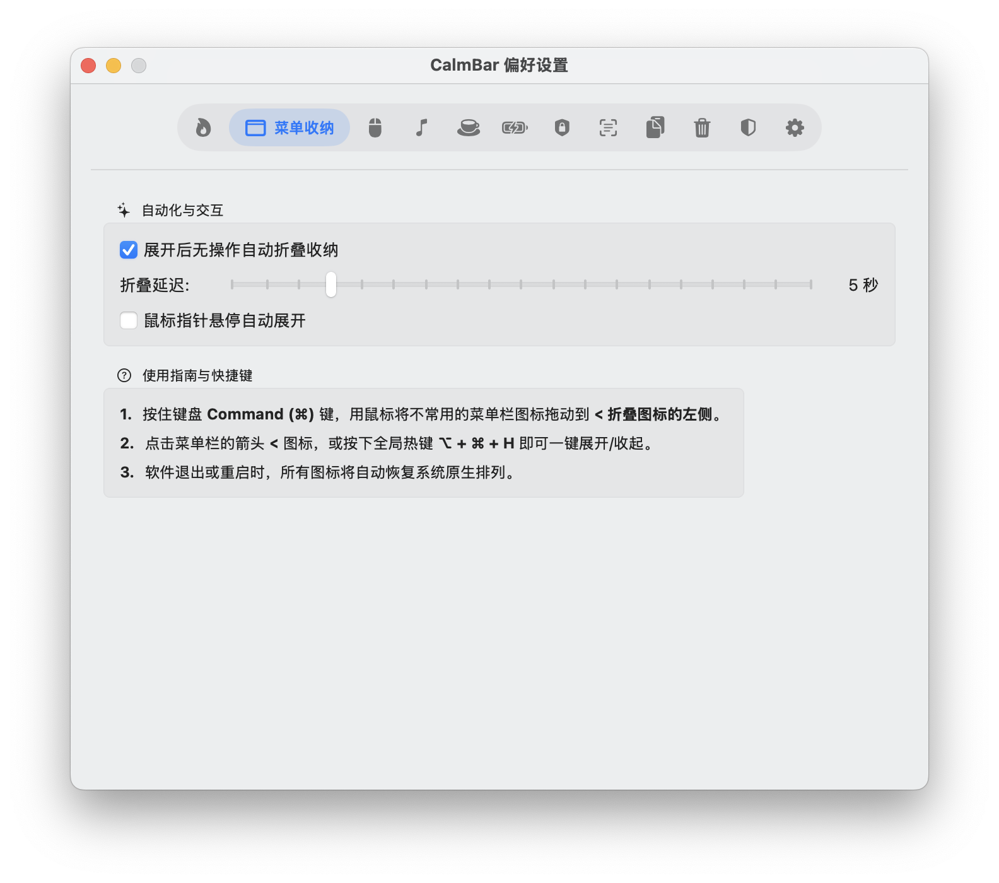
</p>

---

### 4. 🖱️ 外接鼠标自然滚动解耦 (Scroll Reverser)
* **设备级独立配置**：
  * **外接鼠标**：强制反转垂直方向（Y 轴），恢复传统 Windows 风格滚轮滚动习惯。
  * **内建触控板 / Magic Mouse**：100% 保持 macOS 原生自然滚动方向、双指捏合缩放及惯性平滑滑动。
* **底层低延迟**：基于系统级 `CGEventTap` 与精确时序算法，平滑顺畅。
* **🕹️ 操作说明**：在菜单栏控制台点击「自然滚动」开关即可一键开启或关闭鼠标滚轮独立反转。

---

### 5. 🎵 Apple Music / iTunes 启动拦截与替代 (noTunes)
* **静默拦截防御**：监听系统应用启动事件，终止 `com.apple.Music` 与 `com.apple.iTunes` 的自动唤起（如蓝牙耳机重连、媒体按键触碰等场景）。
* **无缝替代启动 (Replacement)**：
  * 支持自定义替代目标：拦截后自动拉起你指定的第三方音乐 App（如 Spotify、网易云音乐、QQ音乐、TIDAL、foobar2000 等）。
  * 支持配置网页版播放器（如 YouTube Music、Spotify Web、SoundCloud 等）。
* **🕹️ 操作说明**：
  * 开启「Music 拦截」开关后，系统误触唤起 Apple Music 时将被瞬间阻止并关闭。
  * 在偏好设置中的 **「音乐拦截」** 页面，可选择替代模式（仅拦截 / 替代打开指定 App / 替代打开网页 URL），并支持一键关闭当前后台运行的 Music。

<p align="center">
  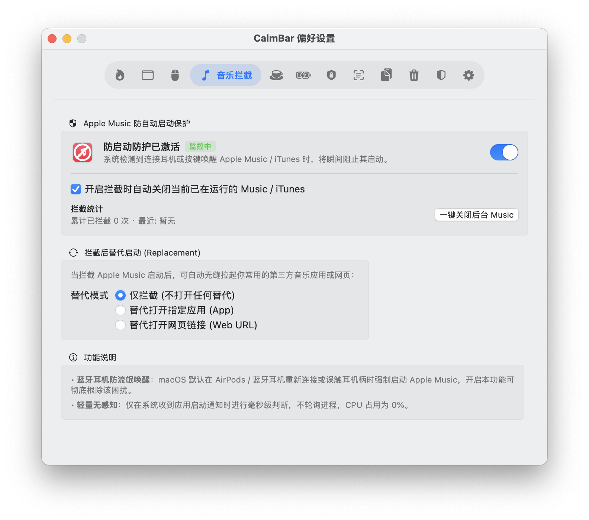
</p>

---

### 6. ☕ 系统防休眠与办公软件防离开 (Caffeine / Keep Awake)
* **IOKit 原生电源断言**：通过 `kIOPMAssertPreventUserIdleDisplaySleep` 阻止显示器休眠、屏幕保护程序与系统睡眠，保障长耗时渲染、编译及下载任务不中断。
* **丰富定时预设**：支持无限期保持清醒，或设定 5m / 15m / 30m / 1h / 2h / 5h 定时倒计时。
* **办公软件防离开仿真 (Keep Apps Active)**：读取 `IOHIDSystem` 真实系统闲置时间，超时自动发送原地微幅 HID 微动，重置系统闲置计时器，降低协同办公软件基于系统闲置时间的 Away 判定。
* **睡眠唤醒与锁屏自适应**：系统睡眠、息屏或多用户锁屏注销时自动挂起微动与轮询，退出 CalmBar 时安全释放所有电源断言。
* **🕹️ 操作说明**：
  * 在主控制台点击「防休眠」开关开启长亮状态；点击 ⏱️ 时钟图标可快捷选择定时保持时长。
  * 在偏好设置的 **「防休眠」** 页面，可开启「防止办公软件闲置离开状态 (Teams / Slack / 飞书 / 钉钉)」，并配置启动时自启与手动睡眠解除策略。

<p align="center">
  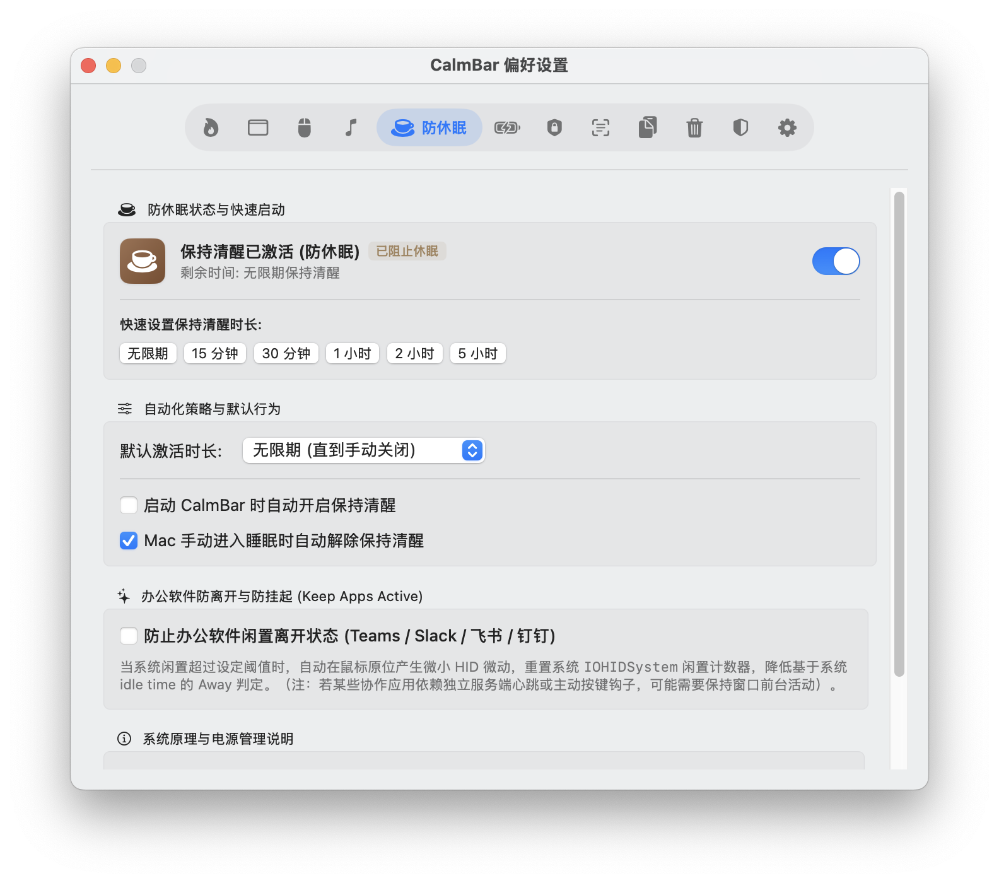
</p>

---

### 7. 🔋 充电管理与电池上限 (Battery Charge Limit)
* **SMC 寄存器充电控制**：通过向 SMC 写入 `CH0C` / `CHTE` 寄存器指令控制充电逻辑，达到设定阈值（默认 80%）后停止对电池充电，转由电源适配器供电（适配支持相关寄存器的 Apple Silicon 与 Intel Mac 机型）。
* **回差巡航模式 (Sailing Mode)**：支持配置回差跨度（如 75% ~ 80%），电量自然消耗回落至下限时才恢复涓流补电，避免在 80% 边缘反复高频微充。
* **底层安全熔断机制 (Safety Melt)**：电量低于 15% 或电池温度过高时，强制终止放电并取消阻断，确保硬件电芯绝对安全。
* **临时充至 100% (Top Up)**：提供一键临时充满模式，放开限制充至满电后自动恢复设定上限，适合出门前临时蓄电。
* **电池健康监控**：实时展示电池健康度 (Health %)、循环计数 (Cycle Count)、电池实时温度及供电功率。
* **🕹️ 操作说明**：
  * 开启「充电保护」开关即可将电量锁定在设定上限并转为旁路供电；点击 ⚡ 按钮可临时充至 100%。
  * 在偏好设置中的 **「充电管理」** 页面，可自由滑动调节目标充电上限（70%~100%）、开启回差巡航模式并查看电池健康度与循环次数。

<p align="center">
  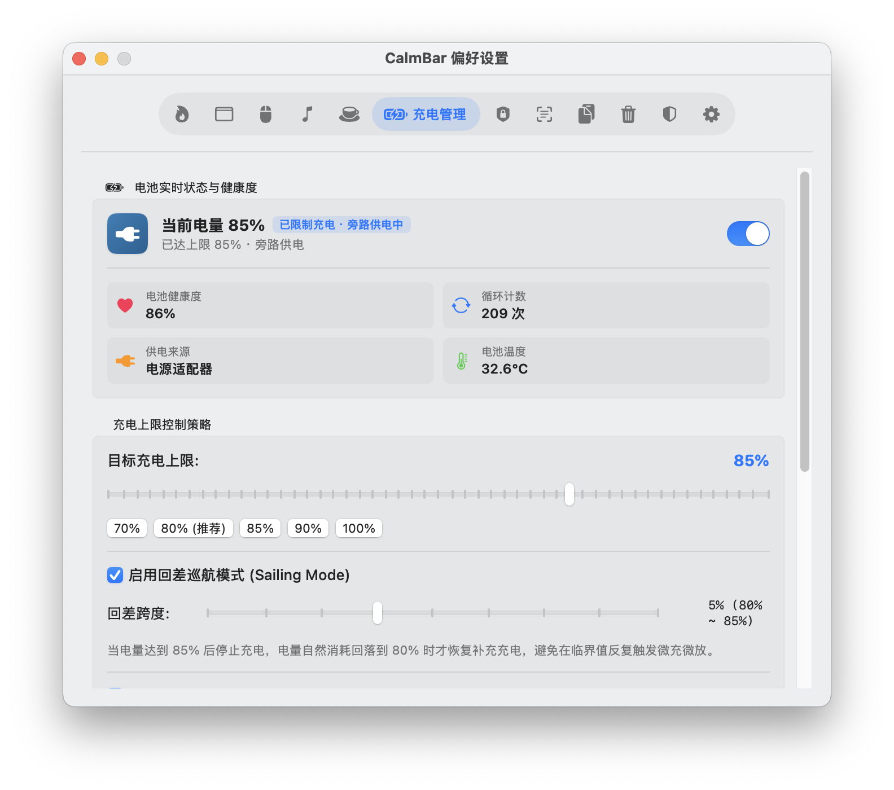
</p>

---

### 8. 🔤 屏幕文字与二维码识别 (Vision OCR & History)
* **Apple 原生深度学习引擎**：基于 macOS 原生 `Vision` 框架深度学习高精模型，零第三方二进制体积，极低内存消耗。
* **多语言与中英混排**：原生适配简体中文、繁体中文、英语、日语、韩语自动识别与代码混排，杜绝符号与汉字乱码。
* **二维码 / 条形码并发解析**：同时检测选区内文本与二维码/条码内容，支持网址识别一键 Safari 直达。
* **舒适毛玻璃悬浮窗**：高对比度排版、一键复制、删除记录，支持在偏好设置中自由配置自动倒计时消失（5s~60s）或常驻。
* **🕹️ 操作说明**：
  1. 点击主面板磁贴中的 **「截屏识字」**（或在命令面板输入 `ocr`）。
  2. 鼠标框选屏幕任意区域，识别结果将自动复制到剪贴板并弹出半透明结果卡片。
  3. 右键「截屏识字」磁贴可快捷打开 **OCR 历史记录窗口** 检索历史识别内容。

<p align="center">
  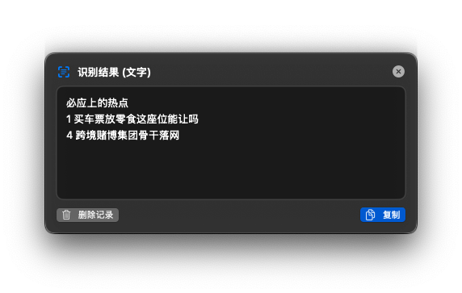
</p>

---

### 9. 📋 剪贴板历史记录与智能识别 (Clipboard History)
* **多模态全格式监听**：纯文本、富文本 (RTF/HTML)、系统截图/复制图像、访达图片/文件 URL、网页链接、十六进制颜色代码等。
* **访达图片智能升格与缩略图**：复制图片文件时自动升格为图片类型并生成高清缩略图与尺寸信息。
* **Vision OCR 后台索引**：自动提取图片中的多语言文字与二维码内容，配合空间感知隔离算法消除噪点，支持全局关键词检索。
* **安全隐私过滤**：自动忽略密码管理器（1Password/Bitwarden/KeePassXC）敏感数据及瞬态复制。
* **独立管理窗口与 Pin 固定**：支持分类筛选（文本/图片/链接/文件/已固定）、Pin 固定保护、LRU 淘汰与磁盘缓存管理。
* **🕹️ 操作说明**：
  1. 点击主面板中的 **「剪贴板」** 磁贴，即可唤起独立剪贴板管理窗口。
  2. 顶部支持按「文本 / 图片 / 链接 / 文件 / 已固定」快速筛选，支持搜索框实时模糊检索。
  3. 点击任意条目右侧的 **「复制」** 即可写回系统剪贴板，点击大头针 📌 即可永久固定防清除。

<p align="center">
  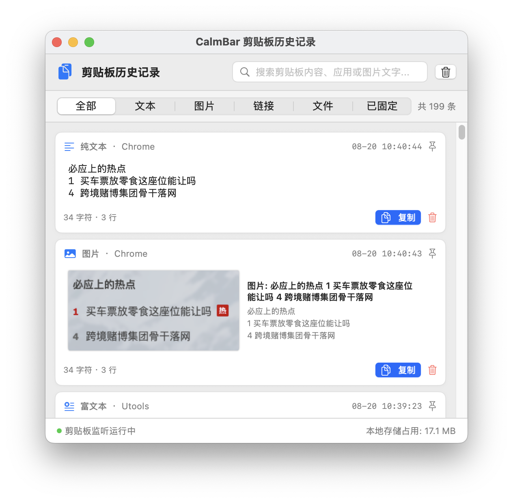
</p>

---

### 10. 🗑️ 软件卸载与开发者深度清理 (App & Developer Cleaner)
* **全量应用索引与架构识别**：多线程并发扫描已安装软件，提取图标、Bundle ID、安装体积、版本号及架构（Apple Silicon / Intel / Universal）。
* **深层残留嗅探引擎**：扫描 `~/Library` 与 `/Library` 下 20+ 个目录，基于 Bundle ID 衍生前缀、名称变体及安全排除列表精准匹配残留文件。
* **完全免密安全移入废纸篓**：多层级静默回退，全流程无需输入密码，误删可直接在系统废纸篓放回原处。
* **24+ 款主流开发工具链缓存清理**：覆盖 Xcode（`DerivedData`、`Archives`、`CoreSimulator` 模拟器等）、Node（Npm/Pnpm/Yarn/Bun/Deno）、Python（Pip/Poetry/Uv/Conda）、Rust（Cargo）、Go、Java（Gradle/Maven）、Flutter 等。
* **IDE 孤立工作区清理**：自动探测 VS Code / Cursor 中工程源码已被删除的历史孤立工作区缓存，支持一键批量清理释放数 GB 磁盘空间。
* **🕹️ 操作说明**：
  1. 点击主面板中的 **「清理中心」** 磁贴唤起清理窗口。
  2. **软件卸载**：在左侧列表中点击任意 App，右侧自动勾选所有深层残留（App Support、Preferences、Caches 等），点击右下角 **「移入废纸篓」** 即可干净卸载。
  3. **开发者清理**：切换至顶部 **「开发者清理」** 选项卡，查看各项工具链与孤立工作区缓存占用，点击对应项的 **「移入废纸篓」** 或 **「清空内容」** 即可瞬间释放空间。

<p align="center">
  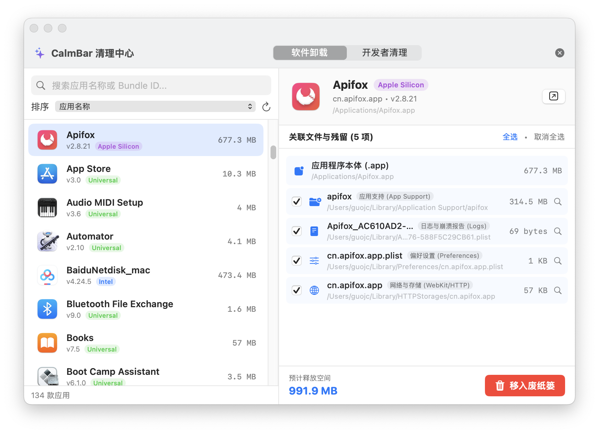
</p>

<p align="center">
  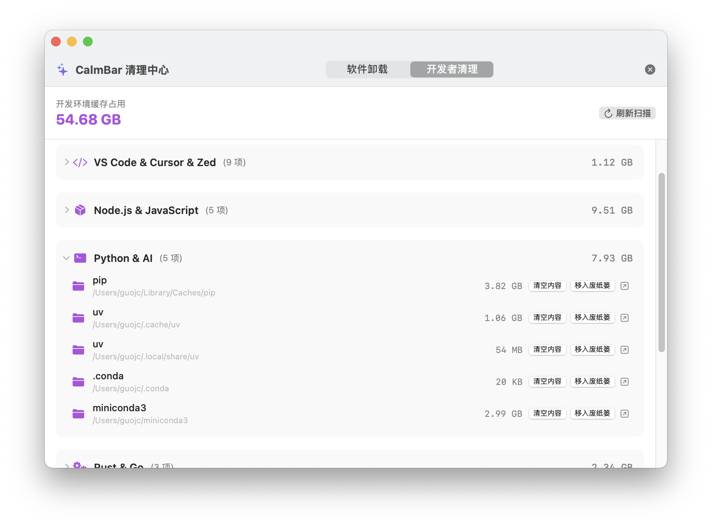
</p>

---

### 11. 🛡️ 未签名与已损坏应用一键授权 (Gatekeeper Quarantine Unlocker)
* **拖拽一键解锁**：直接将报错或未公证的 `.app`、文件夹拖入设置面板，自动执行 `xattr -rd com.apple.quarantine` 解除隔离。
* **深度自签名修复**：支持勾选「深度修复 (Ad-hoc 重签名)」，针对签名损坏或修改过的应用执行 `codesign --force --deep --sign -`。
* **免终端无感提权**：结合特权助手 `CalmBarHelper`，处理 `/Applications` 下需要管理员权限的应用时无需反复输入 `sudo` 密码。
* **🕹️ 操作说明**：在偏好设置中进入 **「应用授权」** 页面，直接将打不开或提示损坏的应用拖拽进虚线框中即可自动解除隔离与重新签名。

<p align="center">
  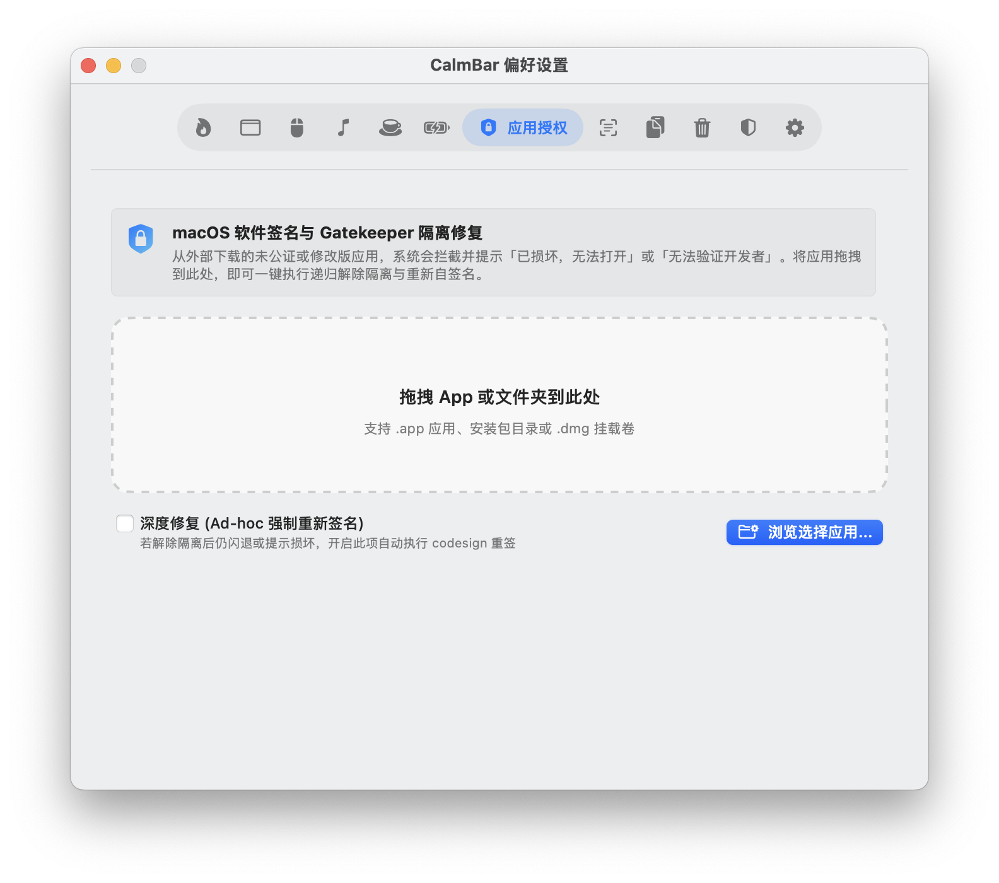
</p>

---

### 12. 🔐 统一权限管理看板 (Permission Center)
* **透明可信的权限管理**：汇总展示辅助功能 (Accessibility)、特权助手 (Privileged Helper)、屏幕录制 (Screen Capture) 与完全磁盘访问权限 (Full Disk Access)。
* **明确使用目的与实时状态**：逐项说明权限对应功能与使用理由，提供一键激活助手与系统设置跳转引导。
* **🕹️ 操作说明**：在偏好设置中点击顶部 **「权限安全」** 选项卡，可查看各项底层权限的关联功能与授权状态；点击「刷新权限状态」可即时同步系统设置中的变更。

<p align="center">
  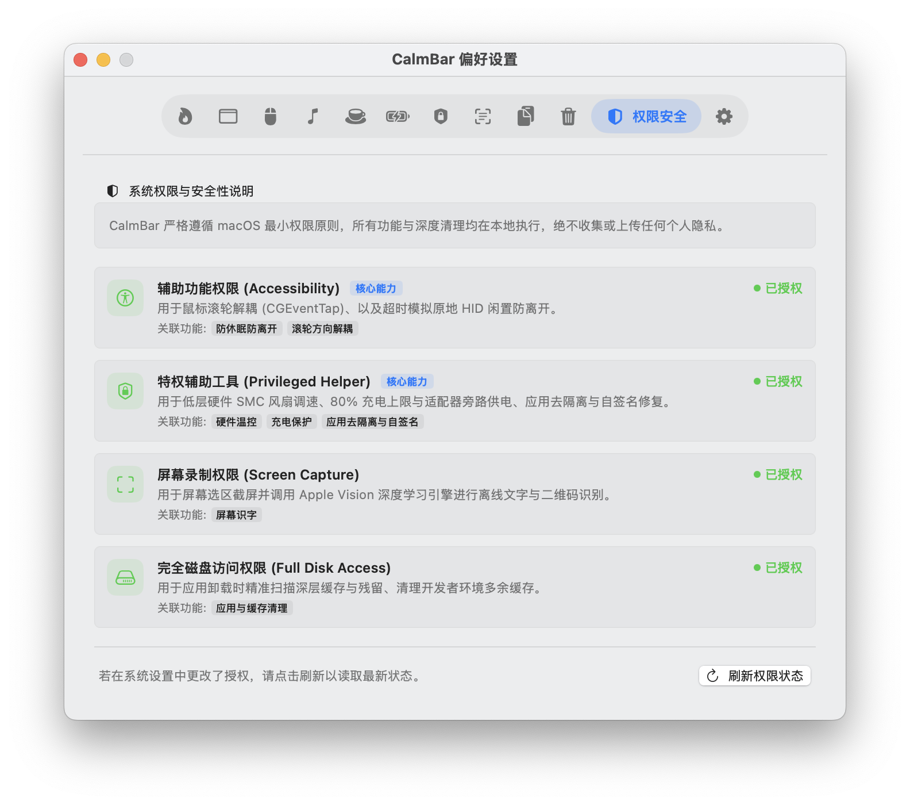
</p>

---

## 🛠️ 技术架构

```text
CalmBar/
├── app/
│   ├── Package.swift                    # SPM 模块与依赖定义
│   ├── build_app.sh                     # 自动编译、签名与打包脚本
│   └── Sources/
│       ├── CalmBar/                     # 主 App 逻辑与 SwiftUI 界面
│       │   ├── AppDelegate.swift        # App 生命周期与菜单栏初始化
│       │   ├── Battery/                 # IOPowerSources 电池监听与充电上限状态机
│       │   ├── Caffeine/                # IOKit 电源断言与 HID 微动防离开引擎
│       │   ├── Cleaner/                 # 应用卸载分析、残留嗅探、开发工具链与工作区清理
│       │   ├── Clipboard/               # 剪贴板监听、安全过滤、OCR 索引与存储管理
│       │   ├── Commands/                # Command Palette 浮动命令面板与调度引擎
│       │   ├── Core/                    # 统一配置、系统事件调度协调器与权限中心管理器
│       │   ├── Features/                # Feature 抽象协议与注册表
│       │   ├── Gatekeeper/              # macOS 隔离属性与自签名修复引擎
│       │   ├── MenuBar/                 # 菜单栏折叠与布局管理器
│       │   ├── Scroll/                  # CGEventTap 滚轮事件拦截器与权限管理
│       │   ├── Services/                # Service 抽象层与 RecoveryCoordinator 安全恢复
│       │   ├── Thermal/                 # 温控轮询引擎与 XPC 通信客户端
│       │   ├── NoTunes/                 # Apple Music / iTunes 启动拦截引擎
│       │   ├── OCR/                     # Vision 文字与条码识别、历史持久化调度
│       │   └── UI/                      # SwiftUI 状态栏控制台、权限安全看板与偏好设置
│       ├── CalmBarKit/                  # 硬件 SMC 读写、安全策略与驱动通信共享库
│       ├── CommandPaletteKit/           # 独立轻量命令面板核心渲染组件
│       └── CalmBarHelper/               # Root 特权辅助工具 (Privileged Helper)
└── doc/
    ├── images/                          # 软件核心功能截图与示例图集
    ├── RELEASE.md                       # 版本发布说明与更新日志
    ├── 核心需求.md                       # 产品需求与架构说明文档
    ├── CalmBar 2.0 优化方案.md           # 2.0 架构与平台化演进方案
    ├── CalmBar 2.0 开发任务步骤.md        # 2.0 任务拆解与交付卡片
    └── CalmBar 新功能接入模板.md          # 2.0 平台化新功能准入与代码模板
```

---

## 🚀 安装与启动方式

### 1. 下载与安装
从 [Releases](https://github.com/chao-eng/CalmBar/releases) 下载发布的 `CalmBar.app`（或 Zip 压缩包），将其拖入 `/Applications`（应用程序）文件夹中即可。

### 2. 首次运行授权（绕过 Gatekeeper 隔离）
由于本项目为个人独立开源软件，未集成 Apple 商业付费证书，在 macOS 上直接双击打开时，系统安全机制（Gatekeeper）可能会拦截并提示 **“应用程序已损坏，无法打开”** 或 **“无法验证开发者”**。

在终端（Terminal）中执行以下命令移除系统的隔离属性即可正常运行：

```bash
sudo xattr -rd com.apple.quarantine /Applications/CalmBar.app
```

> 💡 **提示**：
> * 若应用放置在其他目录，请将路径替换为实际的 `CalmBar.app` 文件路径。
> * CalmBar 内部的 **「应用去隔离」** 功能页面也支持直接拖拽任意 App 一键执行该修复操作。

---

## 📄 开源许可证与致谢

* **GitHub 仓库**：[https://github.com/chao-eng/CalmBar](https://github.com/chao-eng/CalmBar)
* **开源协议**：本项目基于 [Apache License 2.0](LICENSE) 许可证开源。

特别致谢开源社区优秀项目的启发与参考：
* [Pearcleaner](https://github.com/alienator88/Pearcleaner) (macOS App & Dev Cache Cleaner)
* [Aidente](https://github.com/aidente) (SMC Battery Charging Control)
* [Caffeine](https://github.com/caffeine-app) (by Tomas Franzén & Dominic Rodemer)
* [noTunes](https://github.com/tombonez/noTunes) (by Tom Taylor)
* [Scroll Reverser](https://pilotmoon.com/scrollreverser/) (by Pilotmoon)
* [Hidden Bar](https://github.com/dwarvesf/hidden) (by Dwarves Foundation)
* [AirPulse](https://github.com/chaoeng) (SMC Fan Controller)
